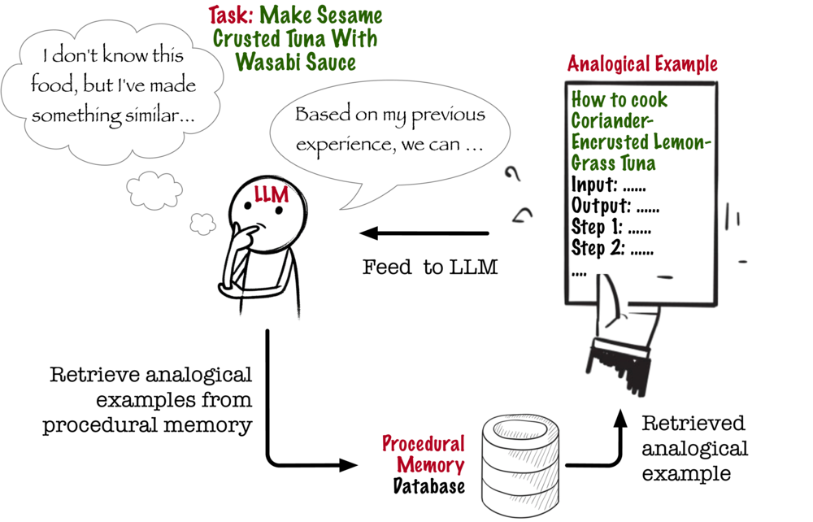
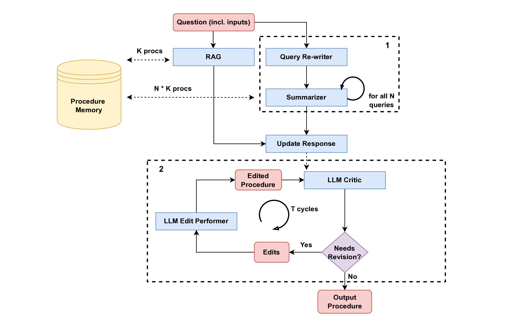
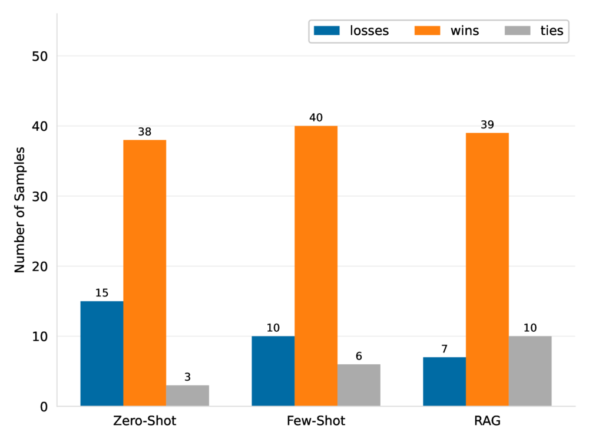
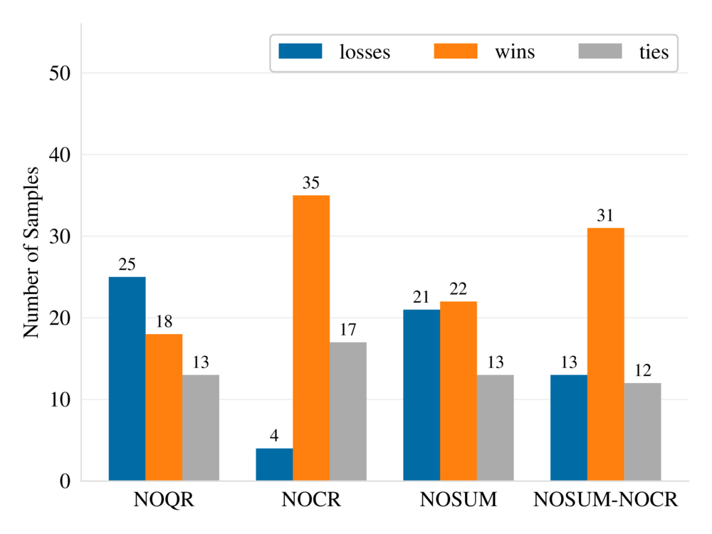

<!-- .slide: id="top" -->
<!-- .slide: data-auto-animate -->

Analogy-Augmented Generation

&nbsp;&nbsp;&nbsp;&nbsp;&nbsp;&nbsp;&nbsp;&nbsp;with Procedural Memory for Procedural Generation

 

<b>Kyle Roth*, Rushil Gupta*</b>, Simon Halle, Bang Liu

  <figure style="width: 25%; text-align: center; margin=0;">
  
  </figure>
  <figure style="width: 50%; text-align: center; margin=0;">
  </figure>
  <figure style="width: 25%; text-align: center; margin=0;">
  
  </figure>

---
<!-- .slide: id="outline" -->

## outline

- motivating example
- procedure structure
- datasets
- AAG pipeline
- experiments
- contributions & future work

---
<!-- .slide: id="chef" -->
<!-- .slide: data-auto-animate -->

## chef François at PAKDD

----
<!-- .slide: id="chef-food" -->
<!-- .slide: data-auto-animate -->

## chef François at PAKDD

---
<!-- .slide: id="task" -->

## task

Note:
The basic idea is to create a system that can adapt known procedures to new tasks, like in this example.

external memory allows **frozen LLM**

---
<!-- .slide: id="procedure" -->
<!-- .slide: data-auto-animate -->

## ## procedural knowledge

<pre data-id="code"><code data-trim data-line-numbers=",2,3,4">
class Procedure:
    input_: str
    output: str
    steps: list[str]
</code></pre>

Note: We structure procedures like this.

- Input represents any kind of starting state required for doing the procedure.
- Output represents the goal or end state of the procedure.
- And the steps are the required steps to accomplish the task.

This formalism introduces **structure** so that a procedure is represented in terms of its context, goal, and steps, which allows for composability.

It's **flexible** because it allows those terms to be defined in natural language.

In the future we will extend this with explicit representations of the dependencies between steps, but we wanted to keep it simple for this project.

---
<!-- .slide: id="procedure2" -->
<!-- .slide: data-auto-animate -->

## ## procedural knowledge

<pre data-id="code"><code data-trim data-line-numbers=",2,3,4">
class Procedure:
    input_: str
    output: str
    steps: list[str]
</code></pre>

The task of **procedure generation** is to predict steps given input_ and output.

---
<!-- .slide: id="recipenlg" -->
<!-- .slide: data-auto-animate -->

## ## datasets

### ### RecipeNLG

<pre data-id="code"><code data-trim data-line-numbers>
Procedure(
    input_="1 lb. lean ground beef, 1 c. chopped onion, 1 c. chopped celery, 4 c. hot water, 2 c. 1/2-inch potato cubes, 1 c. thinly sliced carrots, 1 tsp. salt, 1/2 tsp. dried basil leaves, 1/4 tsp. ginger, 1 bay leaf, 3 tomatoes, cut into eighths and sliced in half",
    output="Autumn Soup (Microwave Recipe)",
    steps=[
        "Mix ground beef, onion and celery in 5-quart casserole dish",
        ...
    ],
)
</code></pre>

2M+ recipes scraped from the internet, we use a random selection of 10k

----
<!-- .slide: id="champ" -->

## ## datasets

### ### CHAMP

<pre data-id="code"><code data-trim data-line-numbers>
Procedure(
    input_="Category: Number-Theory\nHints: ['Study u^3-u mod 2 and u^3-u mod 3 for arbitrary integer u.']",
    output="For three integer numbers a, b, c, if their sum a+b+c is divisible by 6, is their cubed sum a^3+b^3+c^3 always divisble by 6?",
    steps=[
        "u^3-u mod 2=0 since u^3 and u have the same parity.",
        ...
    ],
)
</code></pre>

270 competition-level math problems with step-by-step solutions

----
<!-- .slide: id="lcstep" -->
<!-- .slide: data-auto-animate -->

## ## datasets

### ### LCStep

<pre data-id="code"><code data-trim data-line-numbers>
Procedure(
    input_="an LLM",
    output="set up a custom input schema for a tool with strict requirements and custom validation logic",
    steps=[
        "Define a class `ToolInputSchema` that inherits from `pydantic.BaseModel`. Include the fields you require, in this case a URL, and a root validator method that checks the domain of the URL against a list of approved domains.",
        ...
    ],
)
</code></pre>

276 procedures extracted from LangChain Python docs

    For all experiments, we used a version of GPT-3.5 with a cutoff date before the public release of LangChain.

Note:
This dataset is a good test of our system's ability to produce good results for a topic unfamiliar to the frozen LLM.

----
<!-- .slide: data-auto-animate -->

### ### LCStep

#### #### data preparation

---
<!-- .slide: id="method" -->
<!-- .slide: data-auto-animate -->

## ## pipeline

----
<!-- .slide: data-auto-animate -->

## ## pipeline

  <figure style="width: 35%; font-size: 50%">
    <u>Autumn Soup (microwave recipe)</u>
    <ol>
      <li><b>Microwave cooking times for ground beef</b></li>
      <ul>
        <li style="font-size: 75%">Ground Beef Casserole OAMC</li>
      </ul>
      <li><b>How to properly drain excess fat from cooked ground beef?</b></li>
      <ul>
        <li style="font-size: 75%">Ground Beef Casserole OAMC</li>
      </ul>
      <li><b>Microwave cooking times for potatoes and carrots</b></li>
      <ul>
        <li style="font-size: 75%">Braised Potatoes And Carrots</li>
        <li style="font-size: 75%">Microwave Scalloped Potatoes</li>
        <li style="font-size: 75%">Fast Roasted Potatoes With Paprika</li>
      </ul>
      <li><b>How to know when vegetables are tender in the microwave?</b></li>
      <ul>
        <li style="font-size: 75%">Microwave Scalloped Potatoes</li>
        <li style="font-size: 75%">Fast Roasted Potatoes With Paprika</li>
        <li style="font-size: 75%">Braised Potatoes And Carrots</li>
      </ul>
    </ol>
  </figure>
  <figure style="width: 65%; text-align: center; margin=0;">
    
  </figure>

----
<!-- .slide: data-auto-animate -->

## ## pipeline

---
<!-- .slide: id="outline2" -->

## outline

- motivating example
- procedure structure
- datasets
- AAG pipeline
- **experiments**
- contributions & future work

---
<!-- .slide: id="experiments" -->
<!-- .slide: data-auto-animate -->

## ## experiments

- 3 domains: recipes, Python tutorials, math
- 80% used for procedural memory
  - RecipeNLG: 8000
  - LCStep: 220
  - CHAMP: 216
- 20% for test

---
<!-- .slide: id="baselines" -->

## ## baselines

- **zero-shot** prompting
- **few-shot** with `$k=3$` random procedures from training set
- **RAG** with `$k=3$` procedures retrieved by similarity to input and output
- **ReAct** with retrieval system from RAG as a "search tool"

Note:

- **zero-shot**: prompt the LM to generate the steps from the input and output
- **few-shot**: sample `$k=3$` random procedures from training set, include in prompt after instructions
- **RAG**: same as few-shot but `$k$` procedures are retrieved by similarity to input and output
- **ReAct**: reason+act loop, with retrieval system from RAG as a "search tool" the LLM can use

- vector store: Weaviate
- embedding model: `all-mpnet-base-v2`
- similarity measure: cosine similarity

---
<!-- .slide: id="eval" -->
<!-- .slide: data-auto-animate -->

## ## evaluation

- LLM-based evaluation of generated steps
- pairwise evaluation between generated procedures from 2 methods at a time
- evaluate on:
  - ability to accomplish the goal
  - clarity and flow of steps, level of detail
  - used only the resources in input string
- each pair evaluated 10 times, rotating position
- result is a majority vote
- **backed up with human evaluation where feasible**

---
<!-- .slide: id="results" -->
<!-- .slide: data-auto-animate -->

## ## AAG results

  <figure style="width: 33%; text-align: center; margin=0;">
  
  <figcaption>RecipeNLG</figcaption>
  </figure>
  <figure style="width: 33%; text-align: center; margin=0;">
  
  <figcaption>LCStep</figcaption>
  </figure>
  <figure style="width: 33%; text-align: center; margin=0;">
  
  <figcaption>CHAMP</figcaption>
  </figure>

based on a pairwise evaluation performed by GPT-4

Note:
Note here that relative column height represents evaluator confidence, not necessarily how *much* better the examples were.

AAG outperforms the baselines on all datasets. For RecipeNLG and LCStep, it's by a significant margin.

Note that ReAct was not included in these plots, but it performed strictly worse than RAG in comparison with AAG.

----
<!-- .slide: id="human" -->
<!-- .slide: data-auto-animate -->

## ## AAG results

  <figure style="width: 25%; text-align: center; margin=0;">
  
  <figcaption>RecipeNLG (LLM eval)</figcaption>
  </figure>
  <figure style="width: 25%; text-align: center; margin=0;">
  
  <figcaption>RecipeNLG (human eval)</figcaption>
  </figure>
  <figure style="width: 25%; text-align: center; margin=0;">
  
  <figcaption>LCStep (LLM eval)</figcaption>
  </figure>
  <figure style="width: 25%; text-align: center; margin=0;">
  
  <figcaption>CHAMP (LLM eval)</figcaption>
  </figure>

Note:
***zoom***

The orange bars represent examples where AAG was preferred over the baseline.

The blue bars represent times when the baseline was preferred.

The gray bars represent ties.

Note here that relative column height represents evaluator confidence, not necessarily how *much* better the examples were.

AAG outperforms the baselines on all datasets. For RecipeNLG and LCStep, it's by a significant margin.

Note that ReAct was not included in these plots, but it performed strictly worse than RAG in comparison with AAG.

----
<!-- .slide: id="example" -->
<!-- .slide: data-auto-animate -->

### ### LCStep example

----
<!-- .slide: data-auto-animate -->

### ### LCStep example

----
<!-- .slide: data-auto-animate -->

### ### LCStep example

---
<!-- .slide: id="ablation" -->

## ## ablations

<ul>
<li><b>NOQR</b>: no query rewriting</li>
 
<li><b>NOSUM</b>: no summarization</li>
 
<li><b>NOCR</b>: no critic</li>
 
<li><b>NOSUM-NOCR</b></li>
</ul>

Note:
Here we see that in most cases the 3 main components of AAG added to the quality of the results.

---
<!-- .slide: id="ablation-results" -->

## ## ablations

  <figure style="width: 30%; text-align: center; margin=0;">
  
  <figcaption>RecipeNLG</figcaption>
  </figure>
  <figure style="width: 30%; text-align: center; margin=0;">
  
  <figcaption>LCStep</figcaption>
  </figure>
  <figure style="width: 30%; text-align: center; margin=0;">
  
  <figcaption>CHAMP</figcaption>
  </figure>

Note:
Here we see that in most cases the 3 main components of AAG added to the quality of the results.

---
<!-- .slide: id="conclusion" -->

## ## contributions

- simple, practical framework for operating on procedural knowledge
- novel LLM pipeline that leverages this framework
- showed increased performance over RAG and ReAct
  - especially on an unseen topic (LCStep)

---
<!-- .slide: id="graph" -->
<!-- .slide: data-auto-animate -->

## ## future work

<pre data-id="code"><code>class Procedure:
    input_: str
    output: str
    steps: list[str]
</code></pre>

----
<!-- .slide: id="graph2" -->
<!-- .slide: data-auto-animate -->

## ## future work

<pre data-id="code"><code data-trim data-line-numbers="5,6">class Graph[T, U]:
    inputs: list[Input[T, U]]
    outputs: list[Output[T, U]]

class Procedure(Graph[Step, str]):
    pass

class Step:
    api: str
    desc: str
    args: list[str]

</code></pre>

----
<!-- .slide: id="graph3" -->
<!-- .slide: data-auto-animate -->

## ## future work

- **benefits of a graph representation**
  - represent dependencies, cycles, decision branches
  - can also retrieve subgraphs
- **difficulties**
  - extracting "correct" graphs from text data?
  - good metrics for accuracy of generated graphs, given a reference graph?

---
<!-- .slide: id="end" -->

  

    
  

  

    
thank you!

     
    
<a href="https://arxiv.org/abs/2409.01344">arxiv.org/abs/2409.01344</a>

  

