<style>
  h1, h2, h3, h4, h5, h6 {
    text-align: left;
  }
  figcaption {
    font-size: 0.3em;
    margin: 0;
  }
  .custom-small table {
    font-size: .5em
  }
</style>

<!-- .slide: data-background="predoc/cover.png" -->
<!-- .slide: data-background-size="contain" -->
<!-- .slide: data-background-color="#333333" -->
<!-- .slide: data-background-transition="zoom" -->

---
<!-- .slide: id="outline" -->

# outline

- general background
- analogy-augmented generation (AAG)
- natural language code search
- future plans
  - RedHarbour

---
<!-- .slide: id="background" -->
<!-- .slide: data-auto-animate -->

# # terms

- **LLMs**: <span data-id="llm">large language models</span>
- **LLM agents**
- **information retrieval**
- **RAG**: retrieval-augmented generation

----
<!-- .slide: data-auto-animate -->

## ## <span data-id="llm">large language models</span>

- incl. language models like BERT, GPT-`$i$`, Llama `$k$`
- fuzzy distinction between LMs and LLMs
- **frozen LLM**: a trained LLM whose weights we do not change
- Here we mostly treat LLMs as black-box text completers.

Note: The fuzzy distinction is based on large LMs showing training-free task transfer.

When we say "frozen LLM", we mean an LLM that has been trained beforehand and whose weights we will not modify for the experiment.

The power of frozen LLMs is that we can solve many problems reasonably well with a pipeline of prompted LLMs if we represent the problem in terms of text input and output.

----
<!-- .slide: id="agents" -->

## ## LLM agents

<div class="r-stack">
<div>
<blockquote style="text-align: left;">An <b>autonomous agent</b> is a system situated within and a part of an environment that <u>senses</u> that environment and <u>acts</u> on it, over time, in pursuit of its own <u>agenda</u> and so as to effect what it senses in the future.</blockquote>

<div style="text-align: right; font-size: 0.7em;">― Franklin and Graesser (1997)</div>
<br />
<span class="fragment highlight-red" data-fragment-index="5">
    <span class="fragment" data-fragment-index="6"><b>LLM agents</b> are programs using LLMs which are socially understood to be operating agentically over a text-representable sense and action space.</span>
<span>
</div>
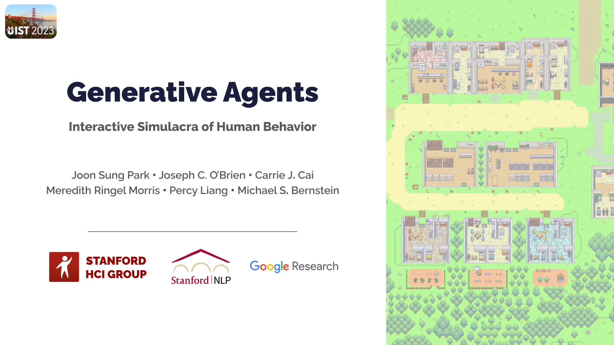</img>
<video
  class="fragment fade-in-then-out"
  data-fragment-index="2"
  data-autoplay loop
  src="predoc/simulacra_display.mp4"
></video>
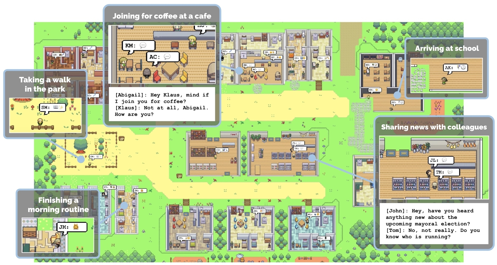</img>
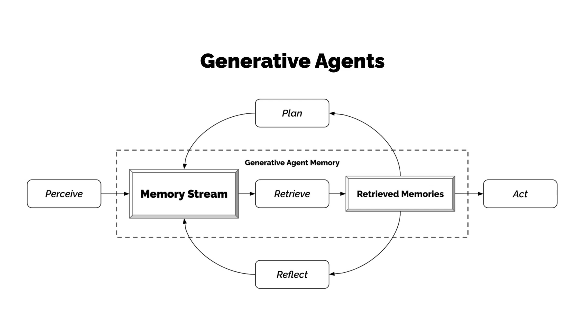</img>
</div>

Note: So under this definition, if we represent the state of an environment with text, and represent the action space with text, we can use an LLM "text completer" as an agent system.

**many such cases**, including this one from the Stanford HCI group. They've built a virtual environment wherein multiple LLM agents can interact with environment and other agents, purely through text representations.

Because the underlying model is an LLM trained to be conversational, they can accomplish their routines and tasks by talking to one another.

For this they've implemented an LLM-based loop that

- perceives its environment,
- retrieves relevant memories,
- progressively plans and reflects,
- and then produces text that is converted into actions in the simulated environment

Going back to the definition, we can define an LLM agent as ...

I say "socially understood" here because it's unclear how we should describe the "agenda" of a prompted LLM. For our purposes, if humans who build or interact with the system understand its actions to represent a recognizable goal, that meets our definition.

----
<!-- .slide: id="ir" -->

## ## information retrieval

<div class="r-stack">
  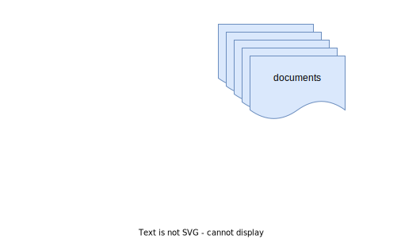
  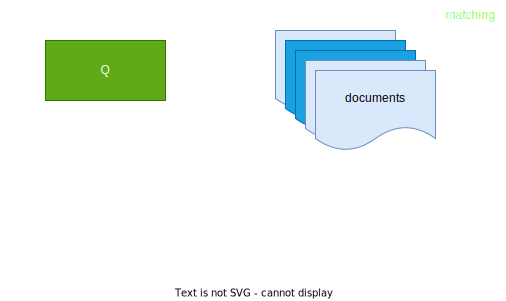
  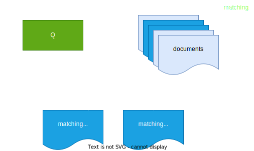
</div>

Note: In many situations it's impossible to include all relevant info in the prompt to an LLM. In many cases LLM agent systems turn to information retrieval techniques.

Here documents can be text, images, or anything.

We usually pick the top documents by computing some sparse features or a dense vector representation, and then ranking by a similarity score.

----
<!-- .slide: id="rag" -->

## ## retrieval-augmented generation

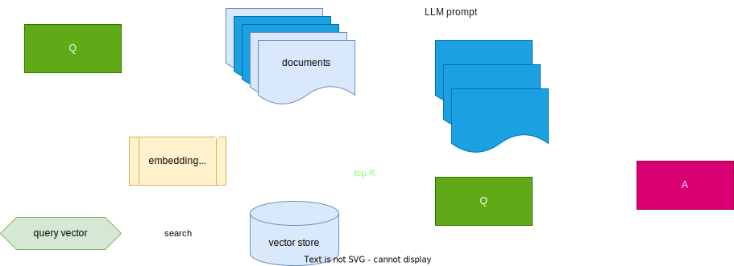

Note: Outside of the agent framework, RAG is a popular approach to augmenting LLMs with external data.

(explain flow)

RAG can be used as part of a wider pipeline as well. The "Simulacra" paper uses retrieval over a memory stream to pull up only memories that are relevant to the agent's current situation.

You could also imagine a more complicated flowchart where there are multiple completion and retrieval steps used to produce an output, whether "action" or something else. This is the broad concept I call **LLM pipelines**.

---
<!-- .slide: id="outline2" -->
<!-- .slide: data-auto-animate -->

# outline

<ul>
<li class="fragment semi-fade-out" data-fragment-index="1">general background</li>
<li class="fragment highlight-blue" data-fragment-index="1"><span data-id="aag">analogy-augmented generation (AAG)</span></li>
<li class="fragment highlight-blue" data-fragment-index="1">natural language code search</li>
<li class="fragment semi-fade-out" data-fragment-index="1">future plans</li>
<ul>
<li class="fragment highlight-green" data-fragment-index="1">RedHarbour</li>
</ul>
</ul>

<br />
<br />

<div style="text-align: right;" display="flex" justify-content="flex-end" class="fragment fade-up" data-fragment-index="1">
<span class="fragment highlight-blue" data-fragment-index="1">LLM pipeline work █</span>
<br />
<span class="fragment highlight-green" data-fragment-index="1">LLM agent work █</span>
</div>

Note: So if we come back to the outline, the first two of my projects are LLM pipelines in this general sense, and RedHarbour could be interpreted as an LLM agent carrying out actions in a desktop computer environment.

---
<!-- .slide: id="aag-top" -->
<!-- .slide: data-auto-animate -->

<div style="text-align: left;">
# <span data-id="aag" data-auto-animate-delay="0.5">analogy-augmented generation (AAG)</span>
</div>

<div style="text-align: right; font-size: 0.5em;">ARR review complete; currently committed to EMNLP 2024</div>

---
<!-- .slide: id="knowledge" -->

## ## types of knowledge

<br />

- **factual knowledge**, or knowledge-that
  <ul style="font-size: 0.7em;">
    <li class="fragment" data-fragment-index="1">e.g. "Kyle was at the university until 2am several nights last week."</li>
    </ul>
- **procedural knowledge**, or knowledge-how
  <ul style="font-size: 0.7em;">
    <li class="fragment" data-fragment-index="2">e.g. write '---' surrounded by blank lines to add a slide</li>
    </ul>

<br />
<br />
<span class="fragment highlight-red" data-fragment-index="3">
    <span class="fragment" data-fragment-index="3">A lot of procedural knowledge exists as text. Can we leverage it explicitly to build LLM pipelines that can plan?</span>
<span>

Note: For humans, procedural knowledge is difficult to verbalize (e.g. how to ice skate). In the brain these two types of knowledge are stored differently.

Even here I've presented this "procedural knowledge" as factual knowledge, by stating it propositionally, i.e. "It is the case that to add a slide ...". So LLMs have seen procedural knowledge as well as factual knowledge.

***click***

In this work we build such a pipeline, which leverages a prepared procedural knowledge store to produce new solutions to procedural questions.

---
<!-- .slide: id="aag-fun" -->

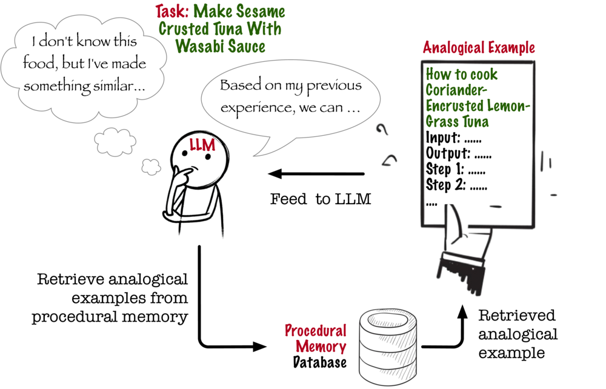

Note:
The basic idea is to create a system that can adapt known procedures to new tasks, like in this example.

---
<!-- .slide: id="procedure" -->

## ## procedural knowledge

<pre data-id="code"><code data-trim data-line-numbers=",2,3,4">
class Procedure:
    input_: str
    output: str
    steps: list[str]
</code></pre>

- structured
- flexible

The task of **procedure generation** is to predict `steps` given `input_` and `output`.

Note: We structure procedures like this.

- Input represents any kind of starting state required for doing the procedure.
- Output represents the goal or end state of the procedure.
- And the steps are the required steps to accomplish the task.

This formalism introduces **structure** so that a procedure is represented in terms of its context, goal, and steps, which allows for composability.

It's **flexible** because it allows those terms to be defined in natural language.

----
<!-- .slide: id="recipenlg" -->
<!-- .slide: data-auto-animate -->

### ### RecipeNLG

<pre data-id="code"><code data-trim data-line-numbers>
Procedure(
    input_="1 lb. lean ground beef, 1 c. chopped onion, 1 c. chopped celery, 4 c. hot water, 2 c. 1/2-inch potato cubes, 1 c. thinly sliced carrots, 1 tsp. salt, 1/2 tsp. dried basil leaves, 1/4 tsp. ginger, 1 bay leaf, 3 tomatoes, cut into eighths and sliced in half",
    output="Autumn Soup (Microwave Recipe)",
    steps=[
        "Mix ground beef, onion and celery in 5-quart casserole dish",
        ...
    ],
)
</code></pre>

2M+ recipes scraped from the internet

----
<!-- .slide: id="lcstep" -->
<!-- .slide: data-auto-animate -->

### ### LCStep

<pre data-id="code"><code data-trim data-line-numbers>
Procedure(
    input_="an LLM",
    output="set up a custom input schema for a tool with strict requirements and custom validation logic",
    steps=[
        "Define a class `ToolInputSchema` that inherits from `pydantic.BaseModel`. Include the fields you require, in this case a URL, and a root validator method that checks the domain of the URL against a list of approved domains.",
        ...
    ],
)
</code></pre>

276 procedures extracted from LangChain Python docs using GPT-4

<span class="fragment highlight-red" data-fragment-index="1">
    <span class="fragment" data-fragment-index="1">For all experiments, we used a version of GPT-3.5 with a cutoff date before the public release of LangChain.</span>
<span>

Note: This dataset is a good test of our system's ability to produce good results for a topic unfamiliar to the frozen LLM.

----

### ### LCStep data preparation

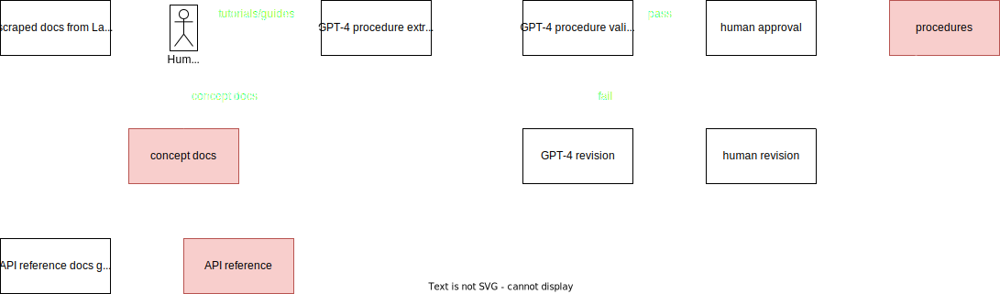

----
<!-- .slide: id="champ" -->

### ### CHAMP

<pre data-id="code"><code data-trim data-line-numbers>
Procedure(
    input_="Category: Number-Theory\nHints: ['Study u^3-u mod 2 and u^3-u mod 3 for arbitrary integer u.']",
    output="For three integer numbers a, b, c, if their sum a+b+c is divisible by 6, is their cubed sum a^3+b^3+c^3 always divisble by 6?",
    steps=[
        "u^3-u mod 2=0 since u^3 and u have the same parity.",
        ...
    ],
)
</code></pre>

270 competition-level math problems with step-by-step solutions

---
<!-- .slide: id="aag-baselines" -->

## ## baselines

- **zero-shot**
- **few-shot** with `$k=3$` random procedures from training set
- **RAG** with `$k=3$` procedures retrieved by similarity to input and output
- **ReAct** with retrieval system from RAG as a "search tool"

<br />
<br />

### ### retrieval details

- vector store: Weaviate
- embedding model: `all-mpnet-base-v2`

Note:

- **zero-shot**: prompt the LM to generate the steps from the input and output
- **few-shot**: sample `$k=3$` random procedures from training set, include in prompt after instructions
- **RAG**: same as few-shot but `$k$` procedures are retrieved by similarity to input and output
- **ReAct**: reason+act loop, with retrieval system from RAG as a "search tool" the LLM can use

---
<!-- .slide: id="aag" -->

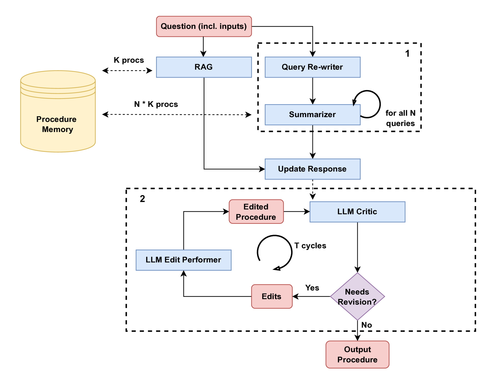

---
<!-- .slide: id="aag-eval" -->

## ## evaluation

- pairwise evaluation between generated procedures from 2 methods at a time
- evaluate on:
  - ability to accomplish the goal
  - clarity and flow of steps, level of detail
  - used only the resources in input string
- each pair evaluated 10 times, rotating position
- result is a majority vote

---
<!-- .slide: id="aag-results" -->

## ## AAG results

<div style="display: flex; justify-content: space-between;">
  <figure style="width: 30%; text-align: center; margin=0;">
  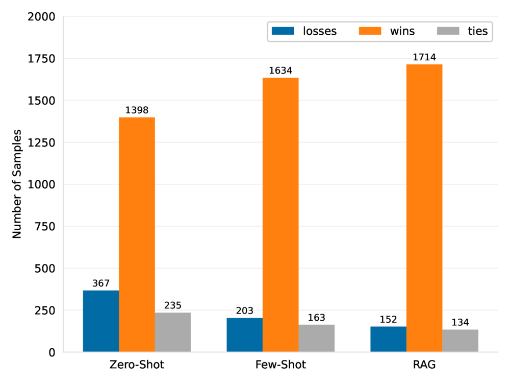
  <figcaption>RecipeNLG</figcaption>
  </figure>
  <figure style="width: 30%; text-align: center; margin=0;">
  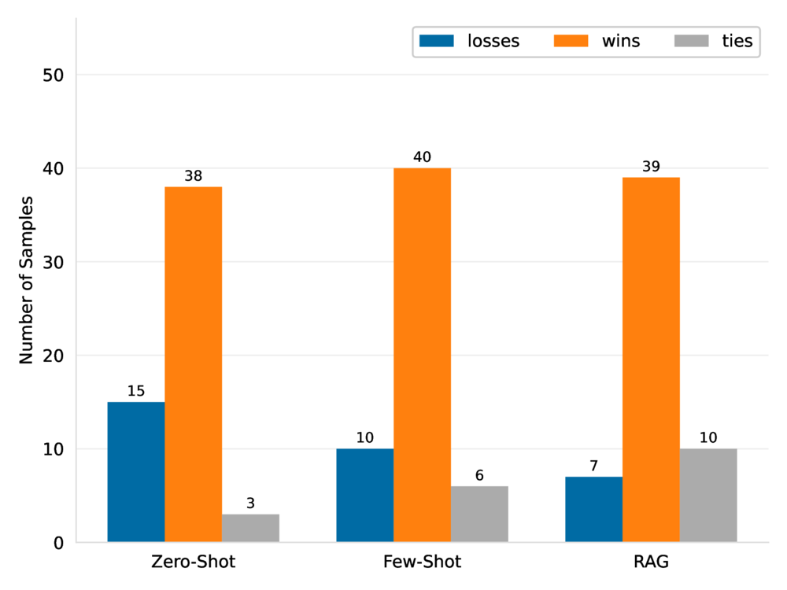
  <figcaption>LCStep</figcaption>
  </figure>
  <figure style="width: 30%; text-align: center; margin=0;">
  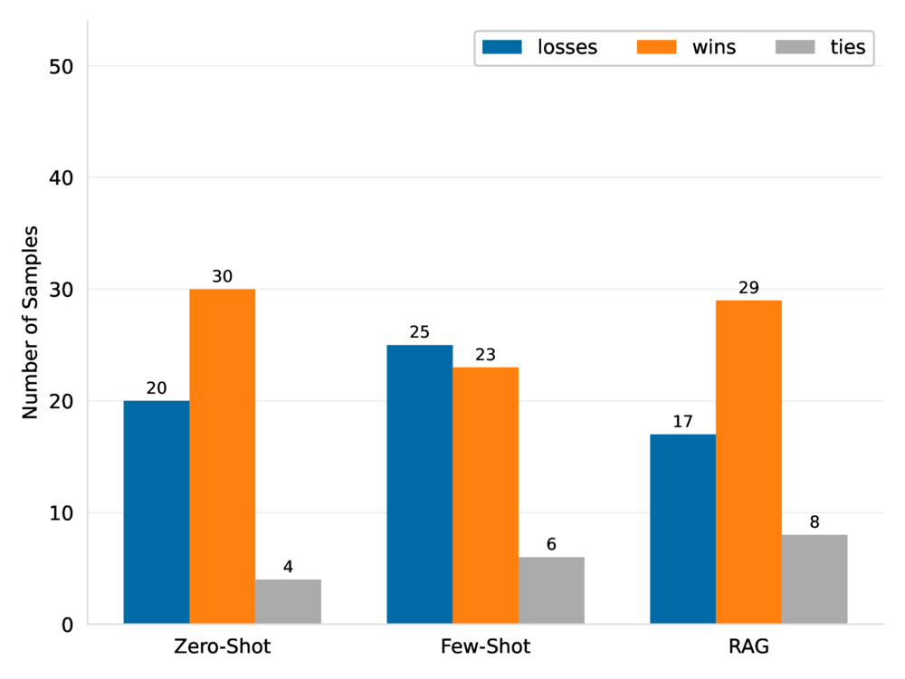
  <figcaption>CHAMP</figcaption>
  </figure>
</div>

based on a pairwise evaluation performed by GPT-3.5

Note:
***zoom***

The orange bars represent examples where AAG was preferred over the baseline.

The blue bars represent times when the baseline was preferred.

The gray bars represent ties.

Note here that relative column height represents evaluator confidence, not necessarily how *much* better the examples were.

AAG outperforms the baselines on all datasets. For RecipeNLG and LCStep, it's by a significant margin.

Note that ReAct was not included in these plots, but it performed strictly worse than RAG in comparison with AAG.

----
<!-- .slide: id="aag-ex" -->

### ### LCStep example

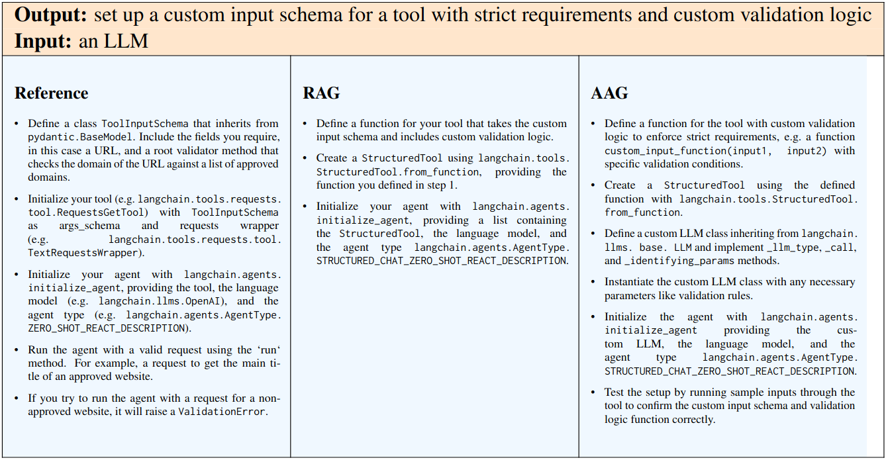

Note:
Here you can see the difficulty in comparing generated procedures with the reference text.

---
<!-- .slide: id="aag-ablation" -->

## ## ablations

<div style="display: flex; justify-content: space-between;">
  <figure style="width: 30%; text-align: center; margin=0;">
  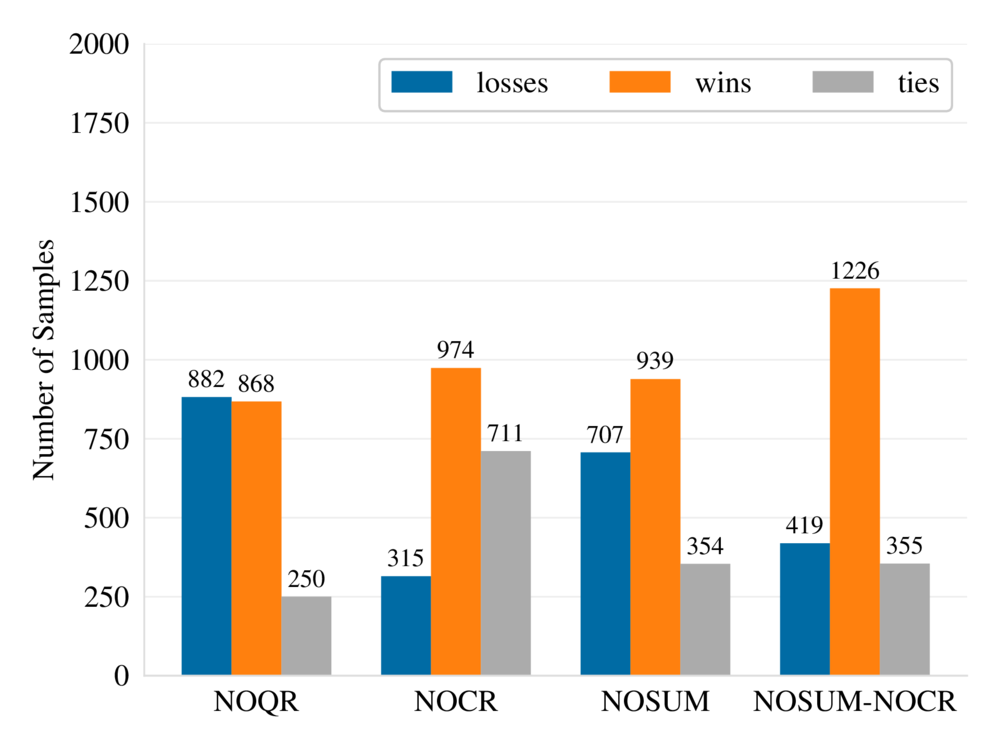
  <figcaption>RecipeNLG</figcaption>
  </figure>
  <figure style="width: 30%; text-align: center; margin=0;">
  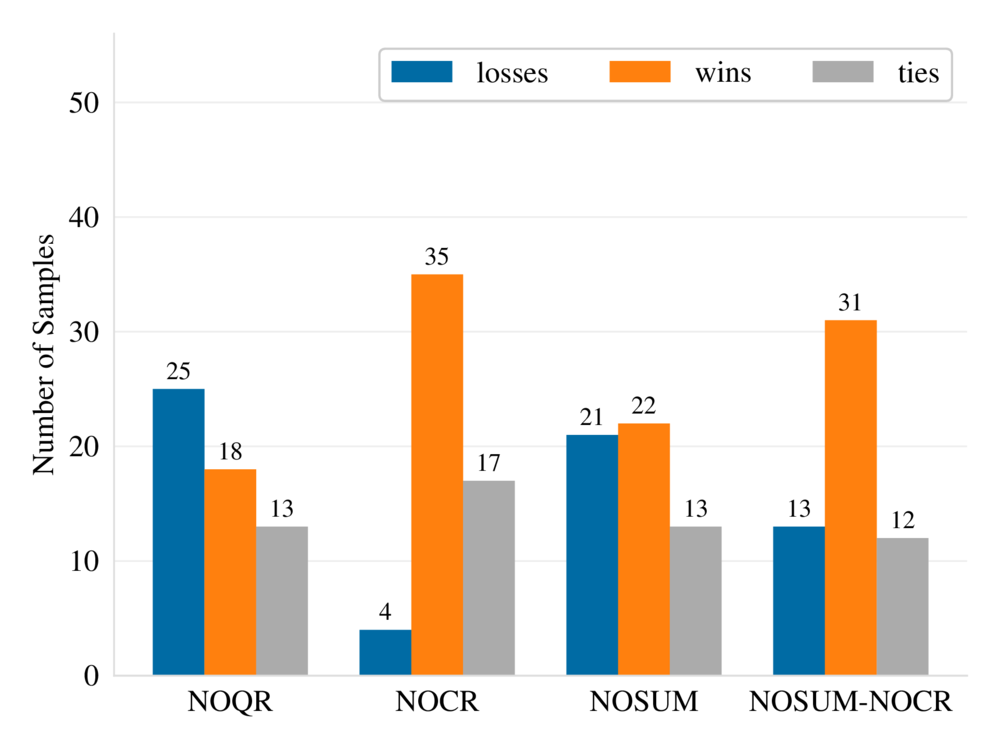
  <figcaption>LCStep</figcaption>
  </figure>
  <figure style="width: 30%; text-align: center; margin=0;">
  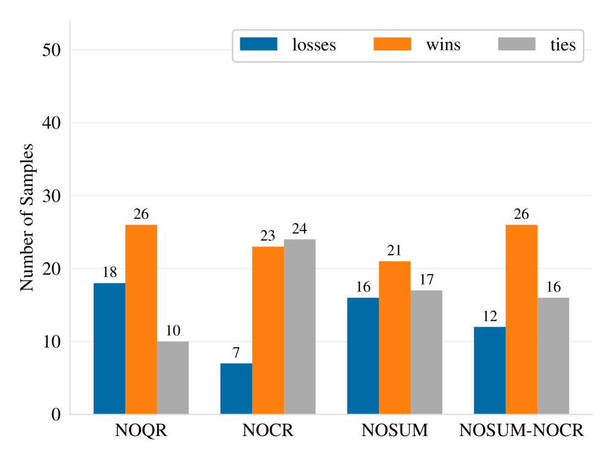
  <figcaption>CHAMP</figcaption>
  </figure>
</div>

<br />

<div style="display: flex; justify-content: space-between;">
<div style="width: 50%; text-align: center;">
<ul>
<li><b>NOQR</b>: no query rewriting</li>
<li><b>NOCR</b>: no self-critic</li>
</ul>
</div>
<div style="width: 50%; text-align: center;">
<ul>
<li><b>NOSUM</b>: no summarization</li>
<li><b>NOSUM-NOCR</b></li>
</ul>
</div>
</div>

Note:
Here we see that in most cases the 3 main components of AAG added to the quality of the results.

---
<!-- .slide: id="aag-conclusion" -->

## ## AAG conclusion

**contributions**

- simple theoretical framework for operating on procedural knowledge
- novel LLM pipeline that leverages this framework
- showed increased performance over RAG and ReAct
  - esp. on an unseen topic (LCStep)

**future work**

- leverage composable nature of framework

---
<!-- .slide: id="cs-top" -->

<div style="text-align: left;">
# industrial-scale natural language code search
</div>

<div style="text-align: right; font-size: 0.5em;">preparing for submission to ICLR 2025</div>

---
<!-- .slide: id="moderne" -->
<!-- .slide: data-background-iframe="https://www.moderne.ai/" -->

Note:
Moderne is a company that builds automated code refactoring tools using rules that operate over abstract syntax trees augmented with formatting information.

They're adding ML systems only in places where they can guarantee correctness.

---
<!-- .slide: id="cs-task-pre" -->
<!-- .slide: data-auto-animate -->

## ## code search tasks

- code search for implementations

<pre data-id="code"><code data-trim data-line-numbers data-noescape>
// example from CodeSearchNet
{
  'id': '0',
  'repository_name': 'organisation/repository',
  'func_path_in_repository': 'src/path/to/file.py',
  'func_name': 'func',
  'whole_func_string': 'def func(args):\n"""Docstring"""\n [...]',
  'language': 'python',
  'func_code_string': '[...]',
  'func_code_tokens': ['def', 'func', '(', 'args', ')', ...],
  'func_documentation_string': 'Docstring',
  'func_documentation_string_tokens': ['Docstring'],
  'split_name': 'train',
  'func_code_url': 'https://github.com/<org>/<repo>/blob/<hash>/src/path/to/file.py#L111-L150'
}
</code></pre>

Note:
When building software, you often want to search through your codebase and libraries for a function that does what you want. CodeSearchNet is a good dataset for that.

But oftentimes when you want to search your code to understand it from an architectural level, searching by functions is not enough.

---
<!-- .slide: id="cs-task" -->
<!-- .slide: data-auto-animate -->

## ## code search tasks

- ~~code search for implementations~~
- code search for callsites

<pre data-id="code"><code data-trim data-line-numbers="|3|4|8-10">
// example from our benchmark
{
    "method": "RequestEntity.post(URI.create(\"https://example.org/body\"))\n.contentType(MediaType.APPLICATION_XML)",
    "query": "sets content type application xml for a post request",
    "library": "SpringBoot",
    "repositoryLink": "https://github.com/spring-cloud/spring-cloud-contract/blob/main",
    "sourceFile": "spring-cloud-contract-wiremock/src/test/java/org/springframework/cloud/contract/wiremock/WiremockMockServerApplicationTests.java",
    "className": "org.springframework.http.RequestEntity$BodyBuilder",
    "methodName": "contentType",
    "argumentTypes": "org.springframework.http.MediaType"
}
</code></pre>

Note: With this project we focus on a different task, where we search for individual callsites that match a query. In this case...

----
<!--.slide: id="cs-task2" -->

### ### invocation search considerations

- context needed
- many different functions may match
- not all calls to that function will match
  - e.g. "set content type to application/xml"
- number of retrievable "documents" (code snippets) is huge

Note: A line of code that calls a function detail what the function does beyond the name.

In a codebase of 60 million lines of code, there are potentially as many snippets that we need to retrieve.

---
<!--.slide: id="cs-diagram" -->

## ## our approach


Note:
We use a scanning recipe from OpenRewrite to visit all method invocations and collect a list of all unique functions called in the codebase, whether in the codebase or a 3rd-party library.

When we get a query, we rank these signatures by similarity, using pre-computed dense embeddings. We then narrow the search space to only those lines of code which call one of the top `$k$` functions.

To balance latency and accuracy, we evaluate these remaining snippets using a pipeline of models, each of which returns a similarity score. For each model, we set upper and lower bounds on similarity ...

----
<!--.slide: id="cs-opt" -->
<!-- .slide: data-auto-animate -->

## ## pipeline optimization

<div style="display: flex; justify-content: space-between;">
    <div style="width: 70%; text-align: center;">
    <ul>
    <li>code snippets $\mathcal{D}=\{d_1,\dots,d_N\}$</li>
    <li>query $q$</li>
    <li>positive matches $\mathcal{P}_q\subset\mathcal{D}$</li>
    <li class="fragment" data-fragment-index="1">ranking functions $\{m_i\}_{i=1}^n$</li>
    <li class="fragment" data-fragment-index="2">task is to produce</li>
    <ul>
        <li class="fragment" data-fragment-index="2">pipeline $p=(m_{i_1},\dots,m_{i_k})$</li>
        <li class="fragment" data-fragment-index="2">thresholds $t=(\ell_1,u_1,\dots,\ell_{k-1},u_{k-1},f_k)$</li>
    </ul>
    <li class="fragment" data-fragment-index="3">minimizing latency $\text{LAT}_N(p,t)$ on search problems of size $N$</li>
    </ul>
    </div>
    <div style="width: 30%; margin-left: 40px;">
    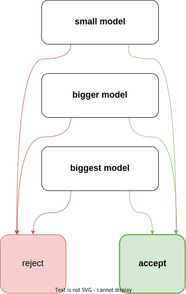
    </div>
</div>

----
<!--.slide: id="cs-opt2" -->
<!-- .slide: data-auto-animate -->

## ## pipeline optimization

<div style="display: flex; justify-content: space-between;">
    <div style="width: 70%; text-align: center;">
    $$\begin{align}\text{Minimize}\quad &amp; \text{LAT}_N(p,t) \\ \text{Subject to}\quad &amp; \text{FPR}_{q,\mathcal{D}}(p,t) &lt; b_+ \\ & \text{FNR}_{q,\mathcal{D}}(p,t) &lt; b_-\end{align}$$
    <br />
    <p class="fragment">set of queries and snippets $\{(q_i,\mathcal{D}_i)\}_{i=1}^m$ as training data</p>
    </div>
    <div style="width: 30%; margin-left: 40px;">
    
    </div>
</div>

Note: This allows us to express the trade-off between latency and accuracy, and tune our pipelines based on our budget for false positives and false negatives.

To perform this optimization practically, we use a set of queries and matching snippets as training data.

----
<!-- .slide: id="cs-data" -->
<!-- .slide: data-auto-animate data-auto-animate-restart -->

### ### training data

<div style="display: flex; justify-content: space-between;">
    <div style="width: 60%; text-align: center;">
    <ul>
    <li>initially used a Moderne-internal dataset of search terms</li>
    <li>will release public dataset for ICLR 2025</li>
    <ul>
    <li>80 search terms</li>
    <li>195 unique code snippets</li>
    <li>sourced from public repositories on GitHub</li>
    </ul>
    </ul>
    </div>
    <div style="width: 40%; margin-left: 40px;">
        <figure style="margin: 0; margin-bottom: 1em;">
        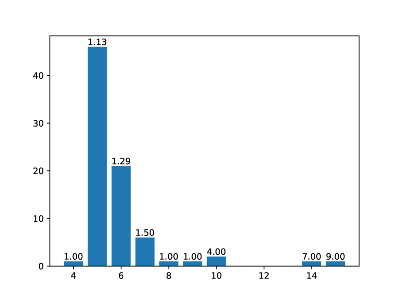
        <figcaption>easy version</figcaption>
        </figure>
        <figure style="margin: 0;">
        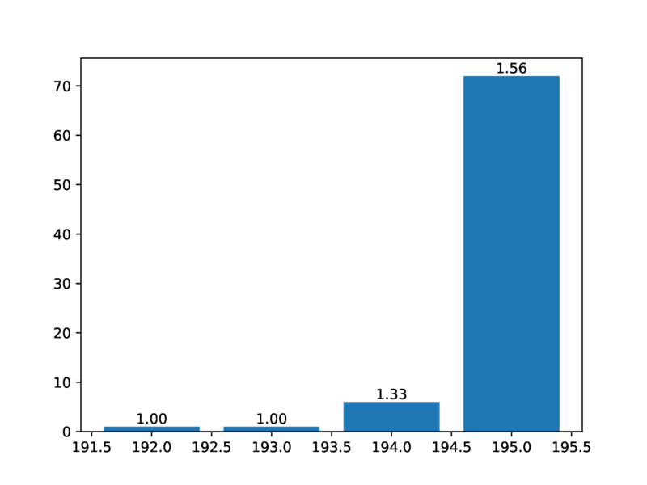
        <figcaption>hard version</figcaption>
        </figure>
    </div>
</div>

----
<!-- .slide: id="cs-tsne" -->
<!-- .slide: data-auto-animate -->

### ### training data

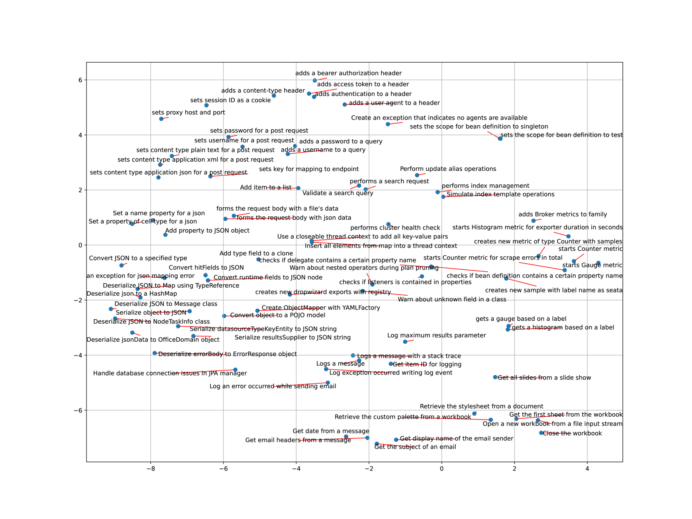

----
<!-- .slide: id="cs-methods" -->

### ### methods

<table style="font-size: 0.5em;">
    <tr>
        <td>method</td>
        <td>est. base latency per query</td>
        <td>est. addtl. latency per candidate</td>
    </tr>
    <tr>
        <td>BGE micro</td>
        <td>34.52ms</td>
        <td>0.0553ms</td>
    </tr>
    <tr>
        <td>MPNet base</td>
        <td>29.36ms</td>
        <td>0.0553ms</td>
    </tr>
    <tr>
        <td>Nomic</td>
        <td>32.05ms</td>
        <td>0.0556ms</td>
    </tr>
    <tr>
        <td>GTE large</td>
        <td>36.94ms</td>
        <td>0.0557ms</td>
    </tr>
    <tr>
        <td>BGE large</td>
        <td>227.49ms</td>
        <td>0.0559ms</td>
    </tr>
    <tr>
        <td>OpenAI large</td>
        <td>505.62ms</td>
        <td>0.0662ms</td>
    </tr>
    <tr>
        <td>SPLADE</td>
        <td>52.03ms</td>
        <td>0.111ms</td>
    </tr>
    <tr>
        <td>reranker large</td>
        <td>0.00ms</td>
        <td>3.66ms</td>
    </tr>
    <tr>
        <td>reranker v2</td>
        <td>0.00ms</td>
        <td>28.38ms</td>
    </tr>
    <tr>
        <td>reranker MiniCPM</td>
        <td>0.00ms</td>
        <td>8.90ms</td>
    </tr>
    <tr>
        <td>CodeLlama</td>
        <td>0.00ms</td>
        <td>21.97ms</td>
    </tr>
</table>

Note: The first models have such low latency per candidate because we cache the static embeddings beforehand.

----
<!-- .slide: id="cs-map" -->

### ### mean average precision (mAP)

<div style="display: flex; justify-content: space-between;">
<div style="width: 50%;">
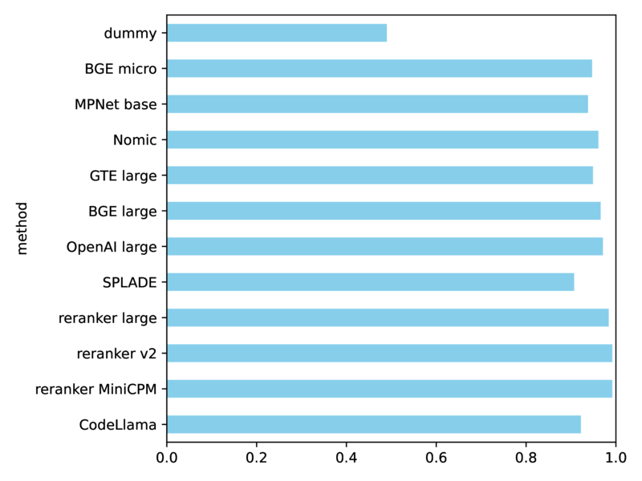
</div>
<div style="width: 50%;">
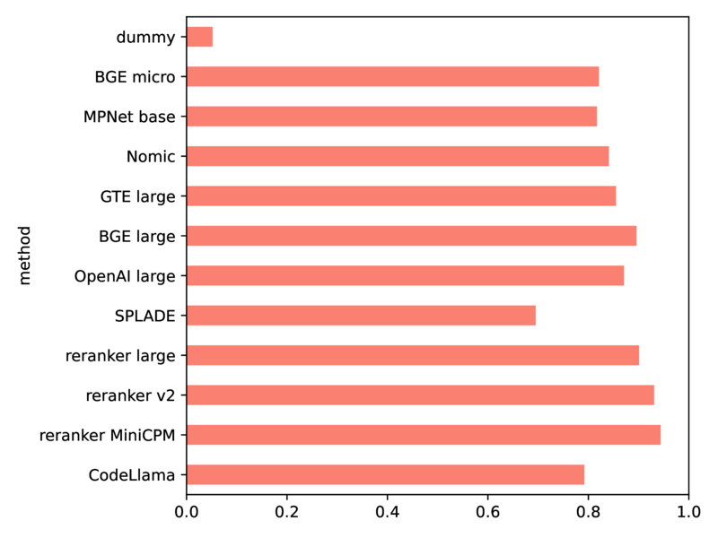
</div>
</div>

Note: `dummy` is a baseline ranker that assigns the same similarity to everything.

----
<!-- .slide: id="cs-anneal" -->

### ### simulated annealing

<div style="display: flex; justify-content: space-between;">
    <div style="width: 70%; text-align: center;">
    $$\begin{align}\text{Given}\quad &amp; p \\ \text{Minimize}\quad &amp; \text{LAT}_N(p,t) \\ \text{Subject to}\quad &amp; \text{FPR}_{q,\mathcal{D}}(p,t) &lt; b_+ \\ & \text{FNR}_{q,\mathcal{D}}(p,t) &lt; b_-\end{align}$$
    <br />
    <p>over the training data $\{(q_i,\mathcal{D}_i)\}_{i=1}^m$</p>
    </div>
    <div style="width: 30%; margin-left: 40px;">
    
    </div>
</div>

Note: We optimize a given pipeline `$p$` using simulated annealing over the thresholds `$t$`. We use the SciPy implementation.

---
<!-- .slide: id="cs-results" -->

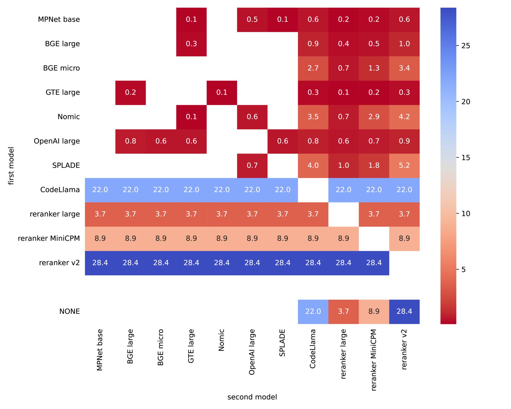

Note: pipelines of length 2

----
<!-- .slide: id="cs-budgets" -->

### ### different budgets

<div style="display: flex; justify-content: space-between;">
  <figure style="width: 50%; text-align: center; margin=0;">
  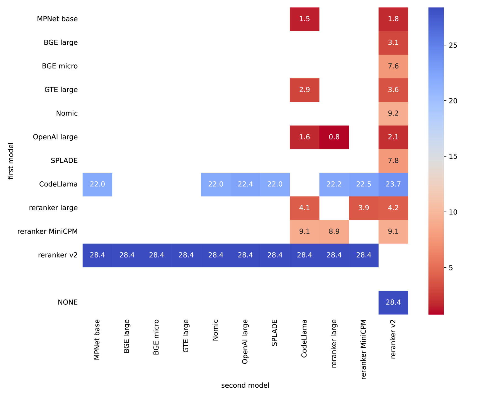
  <figcaption>FPR &lt; 5%; FNR &lt; 2%</figcaption>
  </figure>
  <figure style="width: 50%; text-align: center; margin=0;">
  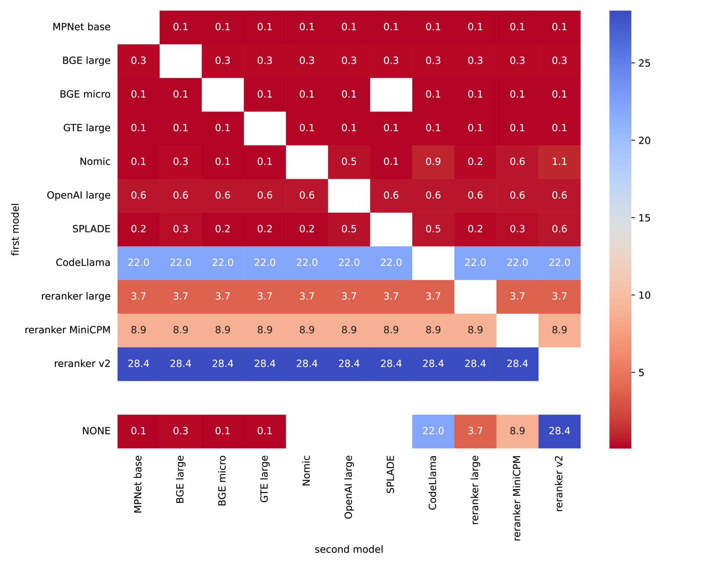
  <figcaption>FPR &lt; 10%; FNR &lt; 5%</figcaption>
  </figure>
</div>

----
<!-- .slide: id="cs-3" -->

### ### pipelines of length &leq; 3

<table style="font-size: 0.5em;">
  <thead>
    <tr>
      <th><strong>max</strong> <br><strong>FPR</strong></th>
      <th><strong>max</strong> <br><strong>FNR</strong></th>
      <th><strong>pipeline</strong></th>
      <th><strong>latency</strong></th>
      <th><strong>latency@1000</strong></th>
    </tr>
  </thead>
  <tbody>
    <tr>
      <td>10%</td>
      <td>5%</td>
      <td>
        $$
        \begin{bmatrix}
        \text{MPNet base} \\
        \text{reranker v2}
        \end{bmatrix}
        $$
      </td>
      <td>29.36ms + n × 0.06ms</td>
      <td>0.089s</td>
    </tr>
    <tr>
      <td>8%</td>
      <td>3%</td>
      <td>
        $$
        \begin{bmatrix}
        \text{GTE large} \\
        \text{Nomic}
        \end{bmatrix}
        $$
      </td>
      <td>57.37ms + n × 0.06ms</td>
      <td>0.117s</td>
    </tr>
    <tr>
      <td>5%</td>
      <td>2%</td>
      <td>
        $$
        \begin{bmatrix}
        \text{MPNet base} \\
        \text{reranker large} \\
        \text{reranker MiniCPM}
        \end{bmatrix}
        $$
      </td>
      <td>29.36ms + n × 0.47ms</td>
      <td>0.499s</td>
    </tr>
  </tbody>
</table>

Note: beam search, caching

---
<!-- .slide: id="cs-conclusion" -->
<!-- .slide: data-auto-animate -->

## ## code search conclusion

**contributions**

- novel pipeline for function-call search
  - deployed in production on Moderne platform
- new small dataset of queries and code snippets
- Python package for similarity threshold optimization

----
<!-- .slide: id="cs-future" -->
<!-- .slide: data-auto-animate -->

## ## code search conclusion

**future work**

- for ICLR 2025:
  - plot Pareto front of accuracy-latency trade-off
  - finish industrial scale benchmark (data already prepared)
    - 114 GitHub repositories of Java code
    - "needle in a haystack"-like
    - compare latency & accuracy with sparse and dense baselines
- future: expand training dataset, continue collaboration with Moderne

---
<!-- .slide: id="outline3" -->
<!-- .slide: data-auto-animate -->

# outline

<ul>
<li class="fragment semi-fade-out" data-fragment-index="1">general background</li>
<li class="fragment highlight-blue" data-fragment-index="1">analogy-augmented generation (AAG)</li>
<li class="fragment highlight-blue" data-fragment-index="1">natural language code search</li>
<li class="fragment semi-fade-out" data-fragment-index="1">future plans</li>
<ul>
<li class="fragment highlight-green" data-fragment-index="1"><span data-id="rh">RedHarbour</span></li>
</ul>
</ul>

<br />
<br />

<div style="text-align: right;" display="flex" justify-content="flex-end" class="fragment fade-up" data-fragment-index="1">
<span class="fragment highlight-blue" data-fragment-index="1">LLM pipeline work █</span>
<br />
<span class="fragment highlight-green" data-fragment-index="1">LLM agent work █</span>
</div>

Note: We've finished talking about two mature projects focused on creating LLM pipelines.

Now we're going to talk about a new project that will greatly expand on this concept of LLM pipelines/agents, within a desktop computing context.

---
<!-- .slide: id="rh-top" -->
<!-- .slide: data-auto-animate -->

<div style="text-align: left;">
# <span data-id="rh" data-auto-animate-delay="0.5">RedHarbour</span>
</div>

<div style="text-align: right; font-size: 0.5em;">multi-year project begun summer 2024</div>

---
<!-- .slide: id="rh-intro" -->
<!-- .slide: data-auto-animate -->

## ## <span data-id="rh">RedHarbour</span> application

<div style="display: flex; justify-content: space-between;">
    <div style="width: 70%; text-align: center;">
    <b>motivation</b>
    <br />
    <ul style="font-size: 0.6em;">
        <li>A chat is the only UI necessary for 95% of LLM applications</li>
        <li>LLM pipelines require little technical knowledge (just prompts + data flow)</li>
        <li>People don't build and share more LLM applications because there are a few hard parts:</li>
        <ul>
            <li><b>Data usage</b> needs clear privacy guarantees</li>
            <li><b>Retrieval</b> can be hard to tune (choice of embeddings, search queries, etc.)</li>
            <li>Integrating <b>tools/APIs</b> requires validation and error-handling</li>
            <li>Quality control &amp; <b>evaluation</b> for NLG is hard to get right</li>
        </ul>
    </ul>
    <span class="fragment highlight-red" data-fragment-index="1">
    <span class="fragment" data-fragment-index="1">Our application will solve the hard parts, so anyone can build and share LLM applications for a desktop environment.</span></span>
    </div>
    <div style="width: 30%; margin-left: 40px;">
    
    </div>
</div>

---
<!-- .slide: id="rh-diagram" -->
<!-- .slide: data-auto-animate -->

## ## <span data-id="rh">RedHarbour</span> design

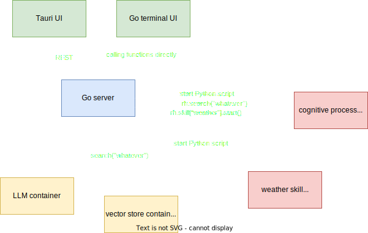

Note:
GUI built with Tauri, terminal UI for quick iteration and automated testing

Main server process in Go, good for RPC-heavy applications

Init skill called at startup, has cognitive process

Skills are run in Docker containers with no network, for sandboxing. Any requests are made with RPCs to Go server over stdin/stdout.

Skills call tools like LLMs, vector stores, other skills

Init skill calls other skills to accomplish tasks

----
<!-- .slide: id="rh-python" -->
<!-- .slide: data-auto-animate -->

## ## <span data-id="rh">RedHarbour</span> design

```python [,|1|3|4-6]
import redharbour as rh

class ResearchAssistant(rh.Skill):
    def start(self): ...
    def on_message(self, m: str): ...
    def stop(self): ...
```

----
<!-- .slide: id="rh-rpc" -->
<!-- .slide: data-auto-animate -->

## ## <span data-id="rh">RedHarbour</span> design

```python [7-10]
import redharbour as rh

class ResearchAssistant(rh.Skill):
    def start(self): ...
    def stop(self): ...
    def on_message(self, m: str):
        # basic RAG
        top3 = rh.search(m, k=3)
        res = rh.llm.completion(self.fmt_prompt(top3, m))
        rh.user.send(res)
    def fmt_prompt(self, topk: list[str], q: str) -> str: ...
```

---
<!-- .slide: id="rh-init" -->

## ## init skill

can start from existing cognitive process designs


---
<!-- .slide: id="rh-data-sources" -->

## ## data sources

- local files
- browser tabs/history
- conversational memory
- others

---
<!-- .slide: id="future" -->

# # future plans

- RedHarbour multi-year project
  - open source
  - ability to share developed skills
  - fine-tuned skill-developing LLM
- AAG
  - committed to EMNLP 2024; otherwise ICLR 2025
  - integrate procedural knowledge formalism into RedHarbour skill planning
- code search
  - needle benchmark
  - integrate pipeline as skill in RedHarbour
  - continued collaboration with Moderne

---
<!-- .slide: id="end" -->

<div style="text-align: right">thank you!</div>
